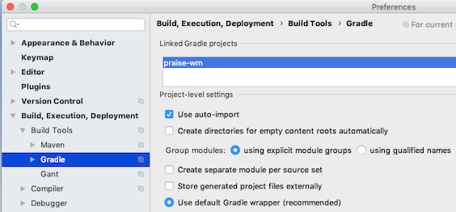
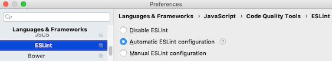

# IntelliJ IDEA Configuration

## Preface
All screen shots were taken using the MacOS version of IntelliJ IDEA.

To get more information on an option, or, if running on a different OS and are unable to find the corresponding options, search the IntelliJ IDEA [documentation][].

If using a different IDE, similar options may be available.

#### NOTE
The project name **dolphin** and associated paths in the screen shots should be adjusted to the name of your project and the paths used when you downloaded the project into your sandbox.

## Table of Contents

1.  [Gradle](#gradle)
1.  [Java Code Formatting](#java-code-formatting)
1.  [Vue.js](#vuejs)
1.  [ESLint](#eslint)
1.  [Flow](#flow)
1.  [Webpack](#webpack)

### Gradle
* Add and enable the Plugin

    

* Use the default wrapper for the current project

    

* Delegate actions for the current project

    

* Remove annoying [balloon notifications][]

    

### Java Code Formatting
* Add and enable the Plugin

    

* Enable the formatter for the current project

    

* To use the formatter, select the *Reformat Code* option from the right-mouse-click menu

    

    * Be sure that the subsequent dialog options are checked

        

* When committing code, be sure that all of following *Before Commit* options are **not** checked

    

### VueJS

* Add and enable the Plugin

    

### ESLint

Configure your IDE so that it looks similar to the screenshot above.
When you click on the browse button for *Node Interpreter* add a new entry by entering values similar to those you see below:

Windows: *The node file will have a .bat extension*

If this feature is not enabled within IDEA, you will still see the ESLint errors as you develop, but you will not see the errors
highlighted within the IDE.

Your project's [.eslintrc.js][] file should already be configured to use the [Airbnb][] style guide rules.

After your IDE is properly configured, the editor should flag code that does not adhear to the style guide. The IDE is able to fix many of these problems for you automatically by selecting the following option from the editor's right-mouse-click menu when editing a .js file.

The above option is only visible when editing a .js file, however, the same auto-fix process is run whenever you run a *yarn* task that build's the client code from either the command line:

    ./gradlew yarn_run_build

  Or from within the IDE:

  

### Flow

Set the following to enable Flow support within the IDE

Windows: *Specify a path to following Flow executable*

    webapp/node_modules/.bin/flow.cmd
  

Create an external tool group so that you can run Flow commands within IntelliJ

  

Start by creating an entry to run the Flow status command

Windows: *Specify a path to following program*

    webapp/node_modules/.bin/flow.cmd

  

Add the remaining Flow commands by creating identical entries except for the parameter:

* --help
* start
* stop
* suggest $FilePath$

Use the *status* command to get a detailed Flow report on any Flow related errors in your project.
This can be very valuable in fixing problems.

Use the *suggest* command on a specific file to get information from Flow on how you can add types to the code.
Flow can do a pretty good job of implicit type analysis and validation, so you probably do not want to explictly type everything, but it will provide valuable suggestions.

The Flow server should start when you need it and stop when you exit IntelliJ, so there is usually not a need to use the start or stop commands.

### Webpack

Set the following to enable IntelliJ to resolve WebPack path aliases

  

[documentation]: https://www.jetbrains.com/help/idea
[balloon notifications]: https://intellij-support.jetbrains.com/hc/en-us/community/posts/115000125290-Indexing-https-plugins-gradle-org-m2
[.eslintrc.js]: ../src/main/webapp/.eslintrc.js
[Airbnb]: https://github.com/airbnb/javascript