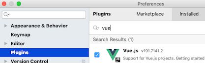

# IntelliJ IDEA Configuration

## Preface
All screen shots were taken using the MacOS version of IntelliJ IDEA.

To get more information on an option, or, if running on a different OS and are unable to find the corresponding options, search the IntelliJ IDEA [documentation][].

If using a different IDE, similar options may be available.

#### NOTE
The project associated paths in the screen shots should be adjusted to the paths used when you downloaded the project into your sandbox.

## Table of Contents

1.  [Gradle](#gradle)
1.  [Java Code Formatting](#java-code-formatting)
1.  [JavaScript](#javascript)
1.  [Vue.js](#vuejs)
1.  [ESLint](#eslint)
1.  [TypeScript](#TypeScript)
1.  [Webpack](#webpack)

### Gradle
* Add and enable the Plugin

    

* Use the default wrapper for the current project

    

* Delegate actions for the current project

    

* Remove annoying [balloon notifications][]

    

### Java Code Formatting
* Add and enable the Plugin

    

* Enable the formatter for the current project

    

* To use the formatter, select the *Reformat Code* option from the right-mouse-click menu

    

    * Be sure that the subsequent dialog options are checked

        

* When committing code, be sure that all of following *Before Commit* options are **not** checked

    

### JavaScript

* Configure the JavaScript language version

    

### VueJS

* Add and enable the Plugin

    
    
* Remove annoying warnings on valid HTML empty element tags used in Vue templates
    
    

### TypeScript

* Enable the TypeScript language service

Configure your IDE so that it looks similar to the screenshot above.

Windows: *The node file will have a .bat extension*

Once TypeScript is configured, you can open the TypeScript tool window by selecting it from the Tool Windows menu

The TypeScript tool window can display any TypeScript errors that are created as you are writing code

### ESLint

If this feature is not enabled within IDEA, you will still see the ESLint errors as you develop, but you will not see the errors
highlighted within the IDE.

Your project's [.eslintrc.js][] file should already be configured to use the [Airbnb][] style guide along with Vue and TypeScript
rules.

After your IDE is properly configured, the editor should flag code that does not adhear to the rules. The IDE is able to fix many of these problems for you automatically by selecting the following option from the editor's right-mouse-click menu when editing a .ts file.

The above option is only visible when editing a .ts file, however, the same auto-fix process is run whenever you run a *yarn* task that build's the client code from either the command line:

    ./gradlew yarn_run_build

  Or from within the IDE:

  

### Webpack

Set the following to enable IntelliJ to resolve WebPack path aliases

  

[documentation]: https://www.jetbrains.com/help/idea
[balloon notifications]: https://intellij-support.jetbrains.com/hc/en-us/community/posts/115000125290-Indexing-https-plugins-gradle-org-m2
[.eslintrc.js]: ../src/main/webapp/.eslintrc.js
[Airbnb]: https://github.com/airbnb/javascript
