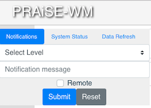
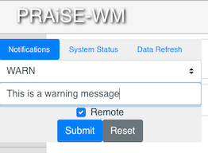
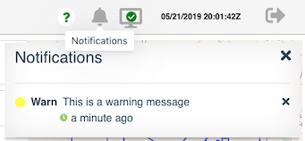
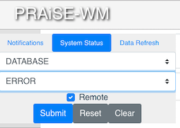
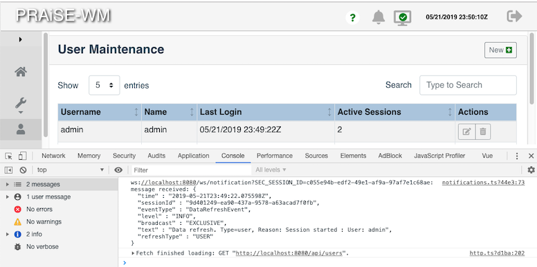
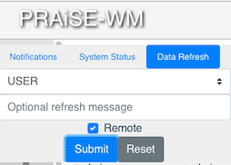

# Developer Test Panel

The Developer Test Panel allows the client to trigger the server to send WebSocket messages to the client to test server message interaction with the UI.

This feature is only accessible during development. It is not available when accessing the client code from the application jar file.

A mouse click on the PRAiSE-WM text at the top-left of the application's browser page will toggle a display of the following panel.

  

Submitting a request with the following values will cause the server to send a notification message to the client.

  
  
  When a notification message is received, the bell icon on the page banner will display a small blue dot.
  
  

Clicking on the bell will display the following notifications panel and remove the blue dot from the bell.

  
  
 
Submitting a request with the following values will cause the server to send a system status message to the client.

  

The system status icon will change in response to a status change.

  

The client framework includes a simple mechanism to support data consistency between simultaneously connected clients. The mechanism is currently only used by the user maintenance form. The following screen shot was taken after a second browser had connected to the application, which is why the number of active sessions is shown as 2. The browser console window shows the receipt of the refresh request that was sent from the server when the 2nd browser client connected, and the subsequent fetch call sent from the client's registered callback, the response from which caused the active sessions count to get updated.

  

Submitting a request with the following values will cause the server to send a similar refresh request, the output of which can be viewed in the browser console. 

  
  
The praise-wm application is currently configured to not require a user to login to the application. Internally, all clients are automatically logged in as user 'admin' with password 'admin'. The server does not allow a REST client to change or delete the admin account.

To activate the login menu and require user/password validation at login, simply change the following variable within the Login.vue component:

    // Set to false to display the login dialog or true to auto-login as the admin user
    autoLogin = true;

If requiring login authentication, the default 'admin' password should also be changed at the [database level][].

[database level]: ../src/main/resources/db/migration/V1.1__createAndInsertUser.sql
