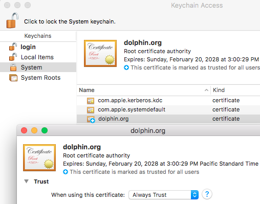
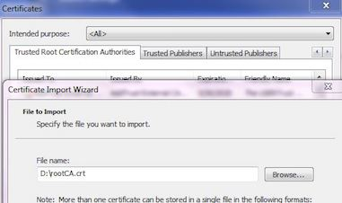
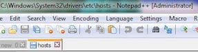
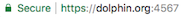

# SSL

Directory *gencerts* contains a Certificate Authority Root Certificate, a server keystore, and the script used to create them.

During development, you will probably not need to create a new CA or keystore.

**NOTE**: In the following graphics, replace the word **dolphin** with **praise-wm**. If you ever need to run the praise-wm application without using SSL, comment-out the *server.ssl.keystoreFile* line in [com.sri.ai.praisewm.cfg]

## Installation

1. During development, the keystore password should be using the default, however, if you have changed the password for the keystore, be sure to set the *keystorePassword* in [com.sri.ai.praisewm.cfg] accordingly.
1. Copy *gencerts/keystore.jks* into the working directory for the praise-wm application.
1. Install *gencerts/rootCA.crt* into your client.
    * MacOS - *Install the certificate into the System keychain and set to `Always Trust`*.
        

    * Windows - *Add the certificate to your browser*.
    Chrome Browser:
        

1. Add an entry to your /etc/hosts file that maps the DNS name used for the certificate to the IP where the praise-wm server will be run.

    For testing on your localhost:

        127.0.0.1       praisewm.org

    * MacOS/Linux

            sudo vi /etc/hosts

    * Windows - *Right-click on your favorite text editor and select to `Run as Administrator`*
        

1. If everything is properly configured, you should be able to access the praise-wm server and see the lock icon using Chrome.
        

      If using Firefox, you will get a warning that *This website does not supply ownership information* and will need to add **2** exceptions via the browser to accept the certificate.

      After adding an exception for the main application port, you need to add a second exception for the WebSocket port which will be the main port plus one.
        

      After adding the exception for WebSocket port you will be able to login to the server using the main port.

      To eliminate the warning would require purchasing an [Extended Validation Certificate][], which involves an additional identity validation process.

## Creating a Root CA and Keystore

[gencerts.sh][] requires openssl and has only been tested on MacOS, although it should work on Linux without modification.

1. Remove all files from *gencerts* other than [gencerts.sh][].
1. Review [gencerts.sh][] and set environmental variables for any defaults that you want to override.
    If you are want to permanently change the defaults used for development, you should edit the default settings contained in the script rather than overriding them. If you change the password setting in the script, be sure to also change the keystore password in [com.sri.ai.praisewm.cfg] and commit them both to the repository.
1. Run [gencerts.sh][]
1. Delete all generated files other than *rootCA.crt* and *keystore.jks*

[gencerts.sh]: ../gencerts/gencerts.sh
[com.sri.ai.praisewm.cfg]: ../src/main/resources/com.sri.ai.praisewm.cfg
[Extended Validation Certificate]: https://en.wikipedia.org/wiki/Extended_Validation_Certificate